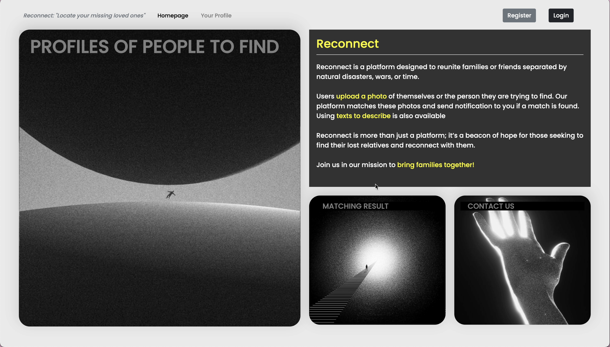
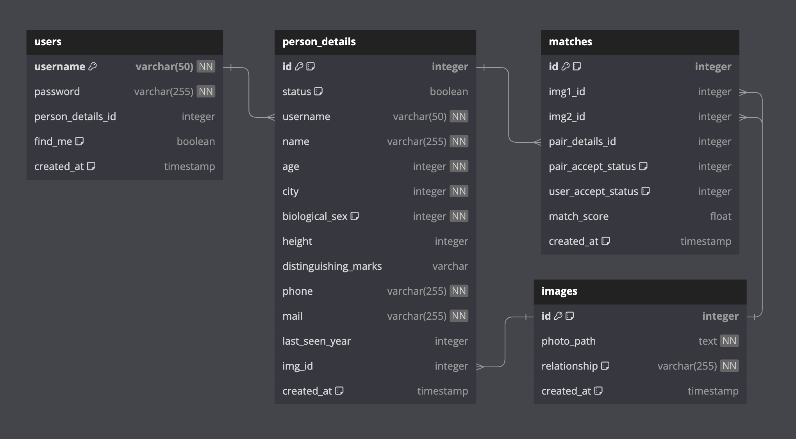

# Reconnect [Final Project MC4AI CoTai]

---
## INTRODUCTION & DESCRIPTION

It is a *one-of-a-kind solution* whose purpose is to **reunite people** who got separated from each other because of natural calamities, wars, or just years.

- During disasters or post-war times, people may get separated from one another or they may have no contact at all. Some people even lose contact with each other during peaceful times. This problem focuses on technology as a means of uniting people on this platform.

- A community for any person from every age group, who has failed to reach out to their kin and has decided to look them up again. Whether you are a victim of a natural disaster or a battlefield, and if it involves losing your beloved person this platform is ready to help you.

- You are actively locating the person by posting a picture of them. When a photo of you matches with those already stored on the server from another user who is looking for you, their contact will be shown after you click accept the result.

This platform is designed to heal broken relationships and promote reunion. It is believed to be full of strength from a union, it brings a cheerful feeling when you meet again, and a cure is found in seeing an absent beloved after a long time. This is the aim of this project.

---
## VIDEO DEMO

- This is the Link: https://youtu.be/kLe7HvBh_pI?feature=shared

---
## CORE FEATURES

- **1) Matching Result**: This platform utilizes advanced technology to help users find their lost ones. When a photo is uploaded, it’s converted into an embedding and stored. These embeddings are then used to calculate cosine similarity, forming a matrix of match scores. The platform uses np.argmin to extract the photo with the highest match score. This process involves data from four files: two numpy files for the embedding matrices (one for the user side and one for the pair side) and two pickle files for mapping the embeddings with their IDs. 

- **2) Find Me and Update Button**: On the personal information page, users can update their details such as height, phone number, or email if they were initially entered incorrectly. Additionally, users can activate the ‘Find Me’ button to allow others to find them. If deactivated, no match results will be shown for that user. 

- **3) Accept and Decline Button**: Once a matching result is displayed, users have the option to either accept or decline the match. Accepting the match triggers a pop-up window displaying the other user’s contact information, facilitating further communication. If the match is declined, the result becomes non-interactive, as it’s not the person the user is looking for. To prevent accidental declines, a JavaScript prompt is used for confirmation. 

- **4) Delete Profiles**: Users have the option to delete profiles of the people they are searching for, similar to the ‘Find Me’ button functionality. If a user no longer wishes to find a particular person, they can delete that person’s profile from the finding page, and no results will be shown for that person. 

In addition to these core features, the platform also pays attention to small details in sign-up and form inputs, ensuring strict adherence to the format in both the front end and back end. The contact page includes an input field for users to send feedback, which can be checked via email. A history section on the portfolio page allows users to keep track of all match results, including declined ones.

---
## DATABASE STRUCTURE

There are 4 tables in the database:

- **users**: This table stores user information. It will create a new row each time a new user signs up. Each user has a unique username, a password, an associated person_details_id, a find_me flag, and a timestamp indicating when the user was created.

- **person_details**: This table stores personal details of users and of people they want to find. Each person has a unique ID, a status, a username, a name, an age, a city, a biological sex (0 or 1), a height, distinguishing marks, a phone number, an email, the last seen year, an associated image id, and a timestamp indicating when the person was added.

- **images**: This table stores image information. Each image has a unique ID, a path to the photo, a relationship status, and a timestamp indicating when the image was added.

- **matches**: This table stores match result information. Each match has a unique ID, two associated image IDs (img1_id and img2_id), two associated detail IDs (pair_details_id and user_details_id), a pair_accept_status (0 for onsite, 1 for decline, 2 for accepted), a match score, and a timestamp indicating when the match was created.

---
## FUTURE TO-DO IF POSSIBLE

- Use text (paragraphs) to find one exact person
- verify face when upload picture of their own
